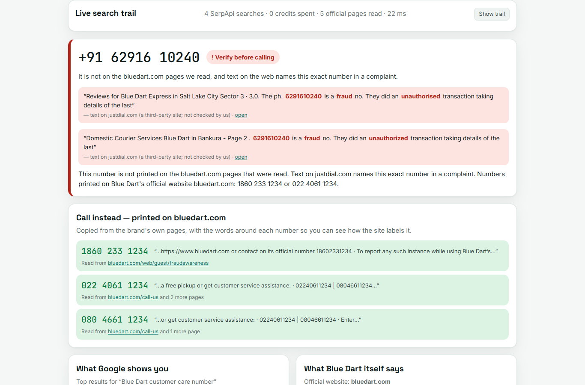
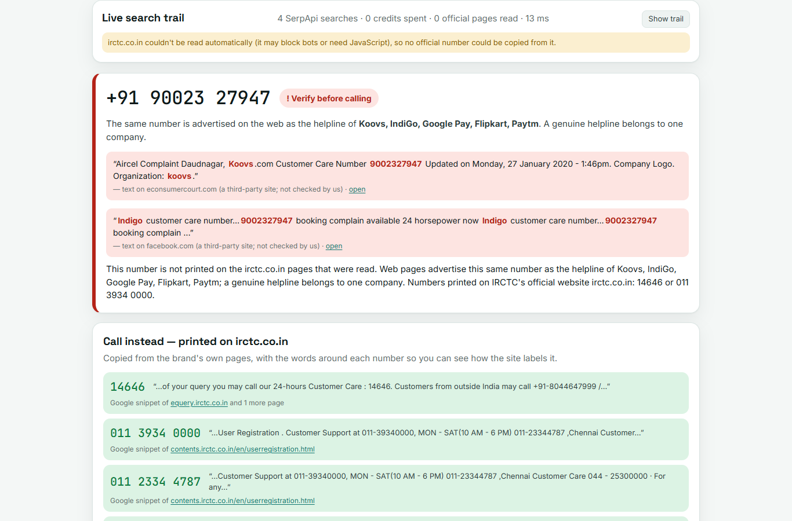

# RightNumber

**Found a customer-care number on Google or Maps? Check it before you dial.**

RightNumber takes a brand and the number you found. It works out the brand's *own* website from live search data, reads the pages that site publishes, and tells you whether the site prints that number, with a link to the page and the words around it. It then shows you the numbers the brand *does* print.

> SerpApi India Hackathon 2026 · Track: **Knowledge & Public Interest** · runs locally, no deployment needed · works with **no API keys** in replay mode



---

## The problem

Victims of the "fake customer-care number" scam didn't click a dodgy link. They searched Google or Maps for a helpline and called the number it showed them.

- **Kerala Police, 3 Oct 2026:** *"not to blindly trust customer care numbers found through internet searches"* ([Outlook India](https://www.outlookindia.com/national/don-t-trust-customer-care-numbers-from-web-searches-keralam-police)).
- **Fact Crescendo, Nov 2025:** *"Google allows users and businesses to add listings, and scammers use this loophole to create fake profiles… Some even have business listings, addresses, or fake 'verified' badges"* ([link](https://english.factcrescendo.com/2025/11/03/fake-customer-care-number-scam/)).
- **Reported losses:**
  - ₹2.73 lakh after calling a doctor's number found on Google ([FPJ, Jul 2026](https://www.freepressjournal.in/bhopal/jabalpur-woman-loses-273-lakh-after-calling-fake-doctor-number-found-on-google)).
  - ₹5 lakh through a fake Uber helpline ([Business Today](https://www.businesstoday.in/amp/technology/news/story/man-loses-rs-5-lakh-after-calling-uber-customer-care-number-which-appeared-on-google-check-details-here-406521-2023-11-21)).
  - ₹4.5 lakh through a fake IRCTC helpline ([Benzinga](https://in.benzinga.com/content/36063678/67-year-old-man-falls-prey-to-4-5-lakh-irctc-helpline-scam)).
- **Scale:** CloudSEK counted 31,179 fake customer-care numbers in 2022 data ([report](https://cloudsek.com/whitepapers-reports/an-analysis-of-the-fake-customer-care-numbers-in-india)).

**Why the existing tools aren't enough:** Truecaller, Sanchar Saathi and I4C's suspect search are *blacklists*. They only know a number after enough people report it, and none of them tells you **what the right number is**. RightNumber does *positive* verification instead: does the brand's own website print this number?

What our own probe of live search data showed for Blue Dart:

- **Google search:** all 10 top results for "Blue Dart customer care number" are Justdial pages. One snippet reads *"6291610240 is a fraud no."*
- **Google Maps:** of 20 "Blue Dart customer care" pins near Delhi, 8 show a number that Blue Dart's site doesn't print. One pin links to a third-party tracking site.

## What you see

| | |
|---|---|
| **Verdict on your number** | ✅ *Printed on the official site* · 🟡 *Not found on the official pages we read* · 🔴 *Verify before calling* (complaint text names this exact number, or the number is advertised as the helpline of several unrelated brands) · ⚪ *Couldn't establish an official source*. It **never says "safe"** and never says "fake" in its own voice. |
| **Call instead** | Numbers copied from the brand's own pages, each with the words around it and a link, so you can check for yourself. |
| **What Google shows you vs what the brand itself says** | How much of the top 10 is directory sites, set against the pages the brand publishes. |
| **Where your number appears** | Only search results whose *own text* contains your exact number, normalised across +91, 0 and spacing. |
| **Google Maps audit** | Each pin's number and website compared with the official site. Mobile numbers are partly masked. |
| **Live search trail** | Every SerpApi call with its engine, purpose and time, marked *live · 1 credit* or *cached · free*, plus every official page read. |

The second killer case: a number someone posted as the "IRCTC refund complaint number" is advertised elsewhere on the web as the helpline of **Aircel, Koovs, IndiGo, Google Pay, Flipkart and Paytm**. A genuine helpline belongs to one company.



## How it works

```
brand (+ number, city) ─┬─ google_maps  "<brand> customer care" near the city   → pins people see (phones, websites)
                        ├─ google       "<brand> customer care number"          → what a victim's search shows
                        ├─ google       "<exact spellings of the number>"       → where this exact number appears
                        └─ Gemini       official domain from its own knowledge   → a domain only, never a number
             ↓ redirect aliases resolved (dtdc.in → dtdc.com, hdfcbank.com → hdfc.bank.in)
             ↓ official domain accepted only when ≥2 independent sources agree (Maps majority · Google results · model)
             ├─ google      "site:<domain> customer care contact number"   → the brand's own contact/help/fraud pages
             └─ plain HTTPS read of up to 5 of those pages (free, same-domain only, size/time-capped, cached)
             ↓ every number extracted and labelled by code: care · fax · warning · another org's · branch · seller desk
             ↓ verdict + "call instead" + pin audit (all computed in code)
             ↓ Gemini 2.5 Flash shortens code-written fact sentences into a 2-line summary (rejected if it adds any digit)
```

### SerpApi engines used, and why each is load-bearing

| Engine | Query | What it gives RightNumber | Without it |
|---|---|---|---|
| `google_maps` | `<brand> customer care` + city `ll` | The pins people actually call: phones, websites, ratings. The majority website is one of the votes for the official domain. | No pin audit, and the official domain is weaker |
| `google` | `<brand> customer care number` (gl=in, google.co.in) | What a victim sees; directory share; official domain in organic results or local pack; snippets of the brand's own pages; complaint text | No "what Google shows you", no complaint evidence |
| `google` | `"<number>" OR "<spelling 2>" …` | Every page whose text contains the exact number: complaints, and the number advertised for other brands | No multi-brand signal, no complaints |
| `google` | `site:<official domain> customer care contact number` | The brand's own contact / help / fraud-awareness pages to read | No way to find the official numbers on large sites |

At most **4 credits per check** (3 with no number). Brand-level searches are cached for 72 h, so checking another number for the same brand costs **1 credit**. SerpApi's own cache makes identical searches within an hour free.

### Guardrails learned from real data (each has a regression test)

- **Partner numbers:** HDFC's fraud page lists Google Pay and WhatsApp helplines as "Partner Customer Care". These are labelled *another organisation's* and never suggested.
- **"Report fraud: call X"** is the brand's own instruction, not a warning about X. Label windows stop at sentence ends, so a scam number in one sentence never borrows "customer care" from the next.
- **User-generated pages on the official domain never count.** Sellers write "Customer care: 93558…" into amazon.in product listings. Listings, reviews, Q&A, forums and blogs are excluded, and seller/partner desks (sell.amazon.in) aren't suggested to customers.
- **Fax lines, emergency numbers (112, 1930) and US numbers (844-311-0406) are never suggested.** Branch and store-locator numbers appear only if the brand publishes nothing for everyone.
- **Indian number formats:**
  - `022 4061 1234` = `02240611234` = `+91-22-40611234`
  - STD codes that start with 6–8 (0612, 080)
  - Delhi's 011
  - 8-digit toll-free numbers (SBI's 1800 1234)
  - AWB / tracking ids, prices, pincodes and decimals are rejected

## Verified against the web

Ten real cases were run on live data and then fact-checked against the web by an independent agent, which opened every cited page. The full log and the list of bugs this found are in [docs/VERIFICATION.md](docs/VERIFICATION.md).

| Case (input) | RightNumber says | Web check | |
|---|---|---|---|
| Blue Dart · 6291610240 (from a Justdial review) | 🔴 Verify before calling: complaint text names it. Call 1860 233 1234 / 022 4061 1234 / 080 4661 1234 | The review calls it "a fraud no."; all 3 numbers are on bluedart.com | ✅ |
| Blue Dart · 1860 233 1234 | ✅ Printed on bluedart.com | "contact on its official number 18602331234" (/fraudawareness) | ✅ |
| Blue Dart · 07016493282 (scam caller on TechEnclave) | 🟡 Not on the official pages | Correct, but the forum report wasn't surfaced | ⚠️ |
| IRCTC · 09002327947 (Facebook "refund number") | 🔴 Advertised as the helpline of Koovs, IndiGo, Google Pay, Flipkart, Paytm. Call 14646 | Posted as a "customer care" number for several brands; 14646 is on IRCTC Contact Us | ✅ |
| IRCTC · 14646 | ✅ Printed on irctc.co.in | Contact Us: "Customer support within India" | ✅ |
| DTDC · +91 9606 911 811 | ✅ Printed on dtdc.com | dtdc.com/customer-care | ✅ |
| HDFC Bank (no number) | Call 1800 1600 / 1800 258 6161 | On hdfc.bank.in (home; /upi/report-frauds) | ✅ |
| SBI · 1800 1234 | ⚪ Abstains (bank.sbi vs sbi.bank.in). One click "Use sbi.bank.in" → ✅ | "Toll free number: 1800 1234" on sbi.bank.in | ✅ / ⚠️ |
| Airtel · 6290133964 (scam caller, complaint site) | 🟡 Not on airtel.in pages; no number suggested | Fair; Airtel's care line is the short code 121, which wasn't on the pages read | ⚠️ |
| Amazon · +91 80 6605 5000 (reported fake) | 🟡 Not on amazon.in pages; no number suggested | Amazon India publishes no phone number; seller-listing numbers are excluded | ✅ |

**7 ✅ · 3 ⚠️ · 0 ❌. No verdict on a user's number overclaimed.** Verification found 10 real bugs before submission, for example fax lines, partner (Google Pay) numbers, seller-listing numbers on amazon.in, appellate officers and franchise stores suggested as "call instead". Each is fixed and has a regression test.

## Quick start

Requires [uv](https://docs.astral.sh/uv/) (Python 3.12 is pinned).

```bash
git clone https://github.com/LoheshM/rightnumber && cd rightnumber
uv sync
uv run uvicorn app.main:app --port 8000
# open http://localhost:8000 and click an example
```

**No keys needed** to try it. With no `SERPAPI_API_KEY` the app runs in **replay mode** on the recorded examples in `data/fixtures/`: SerpApi responses (scrubbed of the key), official pages and LLM outputs.

For live checks, copy `.env.example` to `.env` and add:

```
SERPAPI_API_KEY=...   # https://serpapi.com (free plan: 250 searches/month)
GEMINI_API_KEY=...    # https://aistudio.google.com/apikey (free tier; optional — without it the summary uses a template)
```

Command line: `uv run python -m scripts.check "Blue Dart" "6291610240" Delhi`

Tests: `uv run pytest -q` (705 offline tests: respx blocks the network and keys are removed). Run `uv run ruff check` for lint and `uv run python -m scripts.secret_scan` to check for secrets.

## Limitations (honest)

- **"Not on the official pages we read" ≠ fake.** It may be a genuine branch line. The app says so, and tells you never to pay, share an OTP or install an app for a caller.
- **Some official sites can't be read automatically:**
  - amazon.in and irctc.co.in block bots or need JavaScript; the app then relies on Google's snippets of those pages and says so.
  - Brands spread over several domains (SBI: bank.sbi, sbi.bank.in, onlinesbi.sbi) can't be settled automatically. The app **abstains**, and you can type the official website yourself.
- **Complaint detection** is keyword-based (fraud, scam, cheated…) within ±120 characters of the exact number. Third-party text is quoted and attributed, never endorsed.
- **The multi-brand signal** uses a list of ~80 well-known Indian consumer brands.
- **Snippets can be stale.** The live page may have changed since Google indexed it.
- **Coverage:** Maps pins come from one city per check (10 Indian cities to choose from).

## AI tools disclosure

- **Built with Claude Code** (Anthropic): research agents, idea critique, code, tests, code and security review, and web verification of outputs. All decisions and results were checked by running the app on live data.
- **In the product:** Google **Gemini 2.5 Flash** through its OpenAI-compatible endpoint.
  - It names the brand's official domain, which counts as one vote of three and is confirmed by search and redirects.
  - It shortens code-written facts into a summary that is rejected if it adds any digit or banned word.
  - It never produces a phone number.

## Licence

MIT. See [LICENSE](LICENSE).
